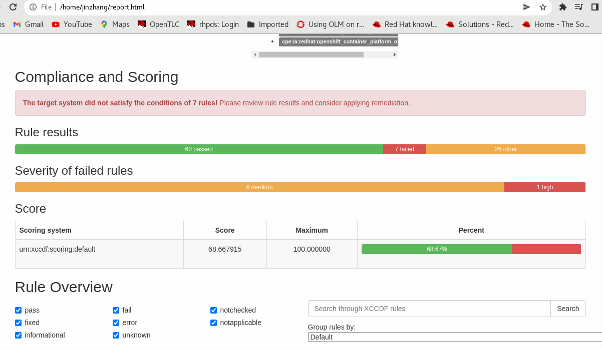

# compliance

**Git**
```
echo "# compliance" >> README.md
git init
git add README.md
git commit -m "first commit"
git branch -M main
git remote add origin https://github.com/alpha-wolf-jin/compliance.git
git config --global credential.helper 'cache --timeout 7200'
git push -u origin main


git add . ; git commit -a -m "update README" ; git push -u origin main
```

**oc logn**
```
# oc login https://api.vuyee8aj.eastus.aroapp.io:6443/
You must obtain an API token by visiting https://oauth-openshift.apps.vuyee8aj.eastus.aroapp.io/oauth/token/request

oc login --token=sha256~ylgJMYfU --server=https://api.vuyee8aj.eastus.aroapp.io:6443
```
## Compliance Operator Deployment


The Compliance Operator lets OpenShift Container Platform administrators describe the required compliance state of a cluster and provides them with an overview of gaps and ways to remediate them.


**Installing Compliance Operator**

- 1. In the OpenShift Container Platform web console, navigate to Operators → OperatorHub.
- 2. Search for the Compliance Operator, then click Install.
- 3. Keep the default selection of Installation mode and namespace to ensure that the Operator will be installed to the openshift-compliance namespace.
- 4. Click Install.

**Verification**

- 1. Navigate to the Operators → Installed Operators page.
- 2. Check that the Compliance Operator is installed in the openshift-compliance namespace and its status is Succeeded.

## Compliance Operator Scan

```
# oc project openshift-compliance
```

**ScanSetting**
```
# cat scansetting.yaml
apiVersion: compliance.openshift.io/v1alpha1
kind: ScanSetting
metadata:
  name: rs-on-workers
  namespace: openshift-compliance
rawResultStorage:
  nodeSelector:
    node-role.kubernetes.io/worker: ""
  pvaccessModes:
  - ReadWriteOnce
  storageClassName: managed-premium
  rotation: 10
  size: 10Gi
roles:
- worker
- master
scanTolerations:
  - operator: Exists
schedule: '0 1 * * *'

# oc apply -f scansetting.yaml


```

>Change the the role and toleration accordingly

https://gitlab.consulting.redhat.com/customer-success/consulting-engagement-reports/client-cers/asean/sg/mha/mha-prod-ocp4.7-3789831#user-content-configuring-openshift-compliance

```
# vi mha-scansetting.yaml
apiVersion: compliance.openshift.io/v1alpha1
kind: ScanSetting
metadata:
  name: mha-scansetting
  namespace: openshift-compliance
rawResultStorage:
  pvAccessModes:
  - ReadWriteOnce
  rotation: 3
  size: 1Gi
roles:
- worker
- master
- ingress
- monitoring
- log
scanTolerations:
- effect: NoSchedule
  key: node-role.kubernetes.io/master
  operator: Exists
- effect: NoSchedule
  key: ingress
  value: reserved
  operator: Equals
- effect: NoSchedule
  key: monitoring
  value: reserved
  operator: Equals
- effect: NoSchedule
  key: log
  value: reserved
  operator: Equals
schedule: 0 1 * * *

# oc get ScanSetting
NAME                 AGE
default              14m
default-auto-apply   14m
rs-on-workers        13m

```
## ScanSettingBinding

```
# cat scansettingbinding.yaml
apiVersion: compliance.openshift.io/v1alpha1
kind: ScanSettingBinding
metadata:
  name: cis-compliance-01
profiles:
  - name: ocp4-cis
    kind: Profile
    apiGroup: compliance.openshift.io/v1alpha1
  - name: ocp4-cis-node
    kind: Profile
    apiGroup: compliance.openshift.io/v1alpha1
settingsRef:
  name: rs-on-workers
  kind: ScanSetting
  apiGroup: compliance.openshift.io/v1alpha1

# oc apply -f scansettingbinding.yaml

# oc get ScanSettingBinding
NAME                AGE
cis-compliance-01   8m35s

```

# How to use the Compliance Operator in Red Hat OpenShift

https://access.redhat.com/solutions/5712421

## The Compliance Operator ships several compliance profiles out of the box
```
# oc get -n openshift-compliance profile.compliance
NAME                 AGE
ocp4-cis             43m
ocp4-cis-node        43m
ocp4-e8              43m
ocp4-moderate        43m
ocp4-moderate-node   43m
ocp4-nerc-cip        43m
ocp4-nerc-cip-node   43m
ocp4-pci-dss         43m
ocp4-pci-dss-node    43m
rhcos4-e8            43m
rhcos4-moderate      43m
rhcos4-nerc-cip      43m

```

**description should contain hints about the profile**
```
[root@localhost compliance]# oc get -n openshift-compliance profile.compliance ocp4-cis-node -o yaml | head
apiVersion: compliance.openshift.io/v1alpha1
description: This profile defines a baseline that aligns to the Center for Internet
  Security® Red Hat OpenShift Container Platform 4 Benchmark™, V1.1. This profile
  includes Center for Internet Security® Red Hat OpenShift Container Platform 4 CIS
  Benchmarks™ content. Note that this part of the profile is meant to run on the Operating
  System that Red Hat OpenShift Container Platform 4 runs on top of. This profile
  is applicable to OpenShift versions 4.6 and greater.
id: xccdf_org.ssgproject.content_profile_cis-node
kind: Profile

```

## Verification of compliance test execution

**The ScanSettingBinding will create a ComplianceSuite**
```
[root@localhost compliance]# oc get compliancesuites
NAME                PHASE   RESULT
cis-compliance-01   DONE    NON-COMPLIANT


```

**ComplianceSuite creates ComplianceScans**

```
# oc get compliancescans 
NAME                   PHASE   RESULT
ocp4-cis               DONE    NON-COMPLIANT
ocp4-cis-node-master   DONE    NON-COMPLIANT
ocp4-cis-node-worker   DONE    NON-COMPLIANT

```

```
[root@localhost compliance]# oc get pods -o wide
NAME                                                        READY   STATUS      RESTARTS      AGE   IP            NODE                                           NOMINATED NODE   READINESS GATES
aggregator-pod-ocp4-cis                                     0/1     Completed   0             42m   10.130.0.54   aro-cluster-zzzmc-k2ssj-master-1               <none>           <none>
aggregator-pod-ocp4-cis-node-master                         0/1     Completed   0             42m   10.128.0.63   aro-cluster-zzzmc-k2ssj-master-0               <none>           <none>
aggregator-pod-ocp4-cis-node-worker                         0/1     Completed   0             42m   10.128.0.62   aro-cluster-zzzmc-k2ssj-master-0               <none>           <none>
compliance-operator-84d85bc88f-h6ks9                        1/1     Running     1 (50m ago)   51m   10.128.0.58   aro-cluster-zzzmc-k2ssj-master-0               <none>           <none>
ocp4-cis-api-checks-pod                                     0/2     Completed   0             43m   10.128.0.60   aro-cluster-zzzmc-k2ssj-master-0               <none>           <none>
ocp4-cis-node-master-aro-cluster-zzzmc-k2ssj-master-0-pod   0/2     Completed   0             43m   10.128.0.61   aro-cluster-zzzmc-k2ssj-master-0               <none>           <none>
ocp4-cis-node-master-aro-cluster-zzzmc-k2ssj-master-1-pod   0/2     Completed   0             43m   10.130.0.53   aro-cluster-zzzmc-k2ssj-master-1               <none>           <none>
ocp4-cis-node-master-aro-cluster-zzzmc-k2ssj-master-2-pod   0/2     Completed   0             43m   10.129.0.76   aro-cluster-zzzmc-k2ssj-master-2               <none>           <none>
ocp4-cis-pv-extract                                         1/1     Running     0             20m   10.128.2.52   aro-cluster-zzzmc-k2ssj-worker-eastus3-j76jg   <none>           <none>
ocp4-openshift-compliance-pp-77849b4ff4-c2gld               1/1     Running     0             50m   10.130.0.52   aro-cluster-zzzmc-k2ssj-master-1               <none>           <none>
openscap-pod-7eae438a8db5097be20881bc53a2d26b593da270       0/2     Completed   0             43m   10.131.0.17   aro-cluster-zzzmc-k2ssj-worker-eastus2-7dgmg   <none>           <none>
openscap-pod-8885e18ac4bfc20261916fbf7f67f9430fb8aed9       0/2     Completed   0             43m   10.128.2.36   aro-cluster-zzzmc-k2ssj-worker-eastus3-j76jg   <none>           <none>
openscap-pod-f2b59d848a1e279ce70a7b1cdf224688d1137361       0/2     Completed   0             43m   10.129.2.20   aro-cluster-zzzmc-k2ssj-worker-eastus1-jvmn4   <none>           <none>
rhcos4-openshift-compliance-pp-77c6d7f7fd-fh89l             1/1     Running     0             50m   10.128.0.59   aro-cluster-zzzmc-k2ssj-master-0               <none>           <none>

```

**Wait until all scans complete**
```
# oc get compliancescans -n openshift-compliance
NAME                   PHASE   RESULT
ocp4-cis               DONE    NON-COMPLIANT
ocp4-cis-node-master   DONE    NON-COMPLIANT
ocp4-cis-node-worker   DONE    NON-COMPLIANT

```

**check results **
```
# oc get ComplianceCheckResult
NAME                                                                           STATUS   SEVERITY
ocp4-cis-accounts-restrict-service-account-tokens                              MANUAL   medium
ocp4-cis-accounts-unique-service-account                                       MANUAL   medium
ocp4-cis-api-server-admission-control-plugin-alwaysadmit                       PASS     medium
ocp4-cis-api-server-admission-control-plugin-alwayspullimages                  PASS     high
ocp4-cis-api-server-admission-control-plugin-namespacelifecycle                PASS     medium
ocp4-cis-api-server-api-priority-gate-enabled                                  PASS     medium
ocp4-cis-api-server-audit-log-maxbackup                                        PASS     low
ocp4-cis-api-server-audit-log-maxsize                                          PASS     medium
ocp4-cis-api-server-audit-log-path                                             PASS     high
ocp4-cis-api-server-auth-mode-rbac                                             PASS     medium
ocp4-cis-api-server-basic-auth                                                 PASS     medium
ocp4-cis-api-server-bind-address                                               PASS     low
ocp4-cis-api-server-client-ca                                                  PASS     medium
ocp4-cis-api-server-encryption-provider-cipher                                 FAIL     medium
ocp4-cis-api-server-encryption-provider-config                                 FAIL     medium
ocp4-cis-api-server-etcd-ca                                                    PASS     medium
...

# oc get ComplianceCheckResult | grep FAIL
ocp4-cis-api-server-encryption-provider-cipher                                 FAIL     medium
ocp4-cis-api-server-encryption-provider-config                                 FAIL     medium
ocp4-cis-audit-log-forwarding-enabled                                          FAIL     medium
ocp4-cis-configure-network-policies-namespaces                                 FAIL     high
ocp4-cis-idp-is-configured                                                     FAIL     medium
ocp4-cis-kubeadmin-removed                                                     FAIL     medium
ocp4-cis-node-master-kubelet-configure-event-creation                          FAIL     medium
...


```

**remediations**
```
# oc get ComplianceRemediation
NAME                                                                             STATE
ocp4-cis-api-server-encryption-provider-cipher                                   NotApplied
ocp4-cis-api-server-encryption-provider-config                                   NotApplied
ocp4-cis-node-master-kubelet-configure-event-creation                            NotApplied
ocp4-cis-node-master-kubelet-configure-tls-cipher-suites                         NotApplied
...

```

**To apply a remediation, edit that object and set its Apply attribute to true**

oc patch -n openshift-compliance complianceremediation ocp4-cis-api-server-encryption-provider-config -p '{"spec":{"apply":true}}' --type='merge'
complianceremediation.compliance.openshift.io/ocp4-cis-api-server-encryption-provider-config patched

**Then, verify**

oc get -n openshift-compliance complianceremediation ocp4-cis-api-server-encryption-provider-config 


# Reverting to original configuration

https://docs.openshift.com/container-platform/4.6/security/compliance_operator/compliance-operator-remediation.html#compliance-unapplying_compliance-remediation

## Applying manual compliance remediations

Failed checks without a complianceremediation object must be remediated manually. In that case, extract all ARF reports from the PhysicalVolumes as shown below and convert them to HTML files. The resulting HTML reports will explain the manual remediation steps that must be taken.


## Rerunning scans

oc annotate compliancescans/<scan_name> compliance.openshift.io/rescan=


# Retrieving scan reports

**The ARF results are stored on Physical Volumes**

```
# oc get pv -n openshift-compliance
NAME                                       CAPACITY   ACCESS MODES   RECLAIM POLICY   STATUS   CLAIM                                       STORAGECLASS      REASON   AGE
pvc-027d1c96-4836-4fce-894b-f9cf1e64dc88   10Gi       RWO            Delete           Bound    openshift-compliance/ocp4-cis-node-worker   managed-premium            81m
pvc-2492fd8d-63ee-497d-ac58-7de275955b9d   10Gi       RWO            Delete           Bound    openshift-compliance/ocp4-cis               managed-premium            81m
pvc-6c8b2230-c1f2-4165-8e2d-3aba9077634e   10Gi       RWO            Delete           Bound    openshift-compliance/ocp4-cis-node-master   managed-premium            81m

# oc get pvc -n openshift-compliance
NAME                   STATUS   VOLUME                                     CAPACITY   ACCESS MODES   STORAGECLASS      AGE
ocp4-cis               Bound    pvc-2492fd8d-63ee-497d-ac58-7de275955b9d   10Gi       RWO            managed-premium   82m
ocp4-cis-node-master   Bound    pvc-6c8b2230-c1f2-4165-8e2d-3aba9077634e   10Gi       RWO            managed-premium   82m
ocp4-cis-node-worker   Bound    pvc-027d1c96-4836-4fce-894b-f9cf1e64dc88   10Gi       RWO            managed-premium   82m

```

**in order to extract results from the 3 tests above, spawn a pod that binds to the 3 PVs**

```
cat <<'EOF' | oc apply -n openshift-compliance -f -
apiVersion: "v1"
kind: Pod
metadata:
  name: pv-extract-ocp4-cis
spec:
  containers:
    - name: pv-extract-pod-ocp4-cis
      image: registry.access.redhat.com/ubi8/ubi
      command: ["sleep", "3000"]
      volumeMounts:
        - mountPath: "/ocp4-cis-vol"
          name: ocp4-cis-vol
  volumes:
    - name: ocp4-cis-vol
      persistentVolumeClaim:
        claimName: ocp4-cis
EOF

# oc get pod/pv-extract-ocp4-cis
NAME                  READY   STATUS    RESTARTS   AGE
pv-extract-ocp4-cis   1/1     Running   0          10s

# oc exec -n openshift-compliance pv-extract-ocp4-cis -- ls /ocp4-cis-vol/0/
ocp4-cis-api-checks-pod.xml.bzip2

# oc cp pv-extract-ocp4-cis:/ocp4-cis-vol/0 .

# ll ocp4-cis-api-checks-pod.xml.bzip2
-rw-r--r--. 1 root root 240026 May 14 20:59 ocp4-cis-api-checks-pod.xml.bzip2

# bunzip2 ocp4-cis-api-checks-pod.xml.bzip2
bunzip2: Can't guess original name for ocp4-cis-api-checks-pod.xml.bzip2 -- using ocp4-cis-api-checks-pod.xml.bzip2.out

# head ocp4-cis-api-checks-pod.xml.bzip2.out
<?xml version="1.0" encoding="UTF-8"?>
<arf:asset-report-collection xmlns:arf="http://scap.nist.gov/schema/asset-reporting-format/1.1" xmlns:core="http://scap.nist.gov/schema/reporting-core/1.1" xmlns:ai="http://scap.nist.gov/schema/asset-identification/1.1">
  <core:relationships xmlns:arfvocab="http://scap.nist.gov/specifications/arf/vocabulary/relationships/1.0#">
    <core:relationship type="arfvocab:createdFor" subject="xccdf1">
      <core:ref>collection1</core:ref>
    </core:relationship>
    <core:relationship type="arfvocab:isAbout" subject="xccdf1">
      <core:ref>asset0</core:ref>
    </core:relationship>
  </core:relationships>

# mv ocp4-cis-api-checks-pod.xml.bzip2.out ocp4-cis-api-checks-pod.xml

# yum install openscap-scanner -y

# oscap xccdf generate report  ocp4-cis-api-checks-pod.xml > report.html

```


# Remediation

## Before Remediation

```
# oc get ComplianceCheckResult | grep FAIL >CheckResultFail.txt

# cat CheckResultFail.txt
ocp4-cis-api-server-encryption-provider-cipher                                 FAIL     medium
ocp4-cis-api-server-encryption-provider-config                                 FAIL     medium
ocp4-cis-audit-log-forwarding-enabled                                          FAIL     medium
ocp4-cis-configure-network-policies-namespaces                                 FAIL     high
ocp4-cis-idp-is-configured                                                     FAIL     medium
ocp4-cis-kubeadmin-removed                                                     FAIL     medium
ocp4-cis-node-master-kubelet-configure-event-creation                          FAIL     medium
ocp4-cis-node-master-kubelet-configure-tls-cipher-suites                       FAIL     medium
ocp4-cis-node-master-kubelet-enable-iptables-util-chains                       FAIL     medium
ocp4-cis-node-master-kubelet-enable-protect-kernel-defaults                    FAIL     medium
ocp4-cis-node-master-kubelet-enable-protect-kernel-sysctl                      FAIL     medium
ocp4-cis-node-master-kubelet-eviction-thresholds-set-hard-imagefs-available    FAIL     medium
ocp4-cis-node-master-kubelet-eviction-thresholds-set-hard-imagefs-inodesfree   FAIL     medium
ocp4-cis-node-master-kubelet-eviction-thresholds-set-hard-memory-available     FAIL     medium
ocp4-cis-node-master-kubelet-eviction-thresholds-set-hard-nodefs-available     FAIL     medium
ocp4-cis-node-master-kubelet-eviction-thresholds-set-hard-nodefs-inodesfree    FAIL     medium
ocp4-cis-node-master-kubelet-eviction-thresholds-set-soft-imagefs-available    FAIL     medium
ocp4-cis-node-master-kubelet-eviction-thresholds-set-soft-imagefs-inodesfree   FAIL     medium
ocp4-cis-node-master-kubelet-eviction-thresholds-set-soft-memory-available     FAIL     medium
ocp4-cis-node-master-kubelet-eviction-thresholds-set-soft-nodefs-available     FAIL     medium
ocp4-cis-node-master-kubelet-eviction-thresholds-set-soft-nodefs-inodesfree    FAIL     medium
ocp4-cis-node-worker-kubelet-configure-event-creation                          FAIL     medium
ocp4-cis-node-worker-kubelet-configure-tls-cipher-suites                       FAIL     medium
ocp4-cis-node-worker-kubelet-enable-iptables-util-chains                       FAIL     medium
ocp4-cis-node-worker-kubelet-enable-protect-kernel-defaults                    FAIL     medium
ocp4-cis-node-worker-kubelet-enable-protect-kernel-sysctl                      FAIL     medium
ocp4-cis-node-worker-kubelet-eviction-thresholds-set-hard-imagefs-inodesfree   FAIL     medium
ocp4-cis-node-worker-kubelet-eviction-thresholds-set-soft-imagefs-available    FAIL     medium
ocp4-cis-node-worker-kubelet-eviction-thresholds-set-soft-imagefs-inodesfree   FAIL     medium
ocp4-cis-node-worker-kubelet-eviction-thresholds-set-soft-memory-available     FAIL     medium
ocp4-cis-node-worker-kubelet-eviction-thresholds-set-soft-nodefs-available     FAIL     medium
ocp4-cis-node-worker-kubelet-eviction-thresholds-set-soft-nodefs-inodesfree    FAIL     medium
ocp4-cis-scc-limit-container-allowed-capabilities                              FAIL     medium

# cat CheckResultFail.txt | wc -l
33

# oc get mc
NAME                                               GENERATEDBYCONTROLLER                      IGNITIONVERSION   AGE
00-master                                          a4fba0f500ff1fdfced1919d81253f147fea02de   3.2.0             27m
00-worker                                          a4fba0f500ff1fdfced1919d81253f147fea02de   3.2.0             27m
01-master-container-runtime                        a4fba0f500ff1fdfced1919d81253f147fea02de   3.2.0             27m
01-master-kubelet                                  a4fba0f500ff1fdfced1919d81253f147fea02de   3.2.0             27m
01-worker-container-runtime                        a4fba0f500ff1fdfced1919d81253f147fea02de   3.2.0             27m
01-worker-kubelet                                  a4fba0f500ff1fdfced1919d81253f147fea02de   3.2.0             27m
90-aro-worker-registries                                                                      2.2.0             30m
99-master-aro-dns                                                                             2.2.0             30m
99-master-generated-registries                     a4fba0f500ff1fdfced1919d81253f147fea02de   3.2.0             27m
99-master-ssh                                                                                 3.2.0             30m
99-worker-aro-dns                                                                             2.2.0             30m
99-worker-generated-kubelet                        a4fba0f500ff1fdfced1919d81253f147fea02de   3.2.0             11m
99-worker-generated-registries                     a4fba0f500ff1fdfced1919d81253f147fea02de   3.2.0             27m
99-worker-ssh                                                                                 3.2.0             30m
rendered-master-3b0fa941cbb3b883ba1dbb3b6188beef   a4fba0f500ff1fdfced1919d81253f147fea02de   3.2.0             27m
rendered-worker-18d76dfbe03dc823d8e4c2005c7b9634   a4fba0f500ff1fdfced1919d81253f147fea02de   3.2.0             11m
rendered-worker-782f4a4ebaa397efe95f1a9daebb5cc2   a4fba0f500ff1fdfced1919d81253f147fea02de   3.2.0             27m

# oc get mcp
NAME     CONFIG                                             UPDATED   UPDATING   DEGRADED   MACHINECOUNT   READYMACHINECOUNT   UPDATEDMACHINECOUNT   DEGRADEDMACHINECOUNT   AGE
master   rendered-master-3b0fa941cbb3b883ba1dbb3b6188beef   True      False      False      3              3                   3                     0                      29m
worker   rendered-worker-18d76dfbe03dc823d8e4c2005c7b9634   True      False      False      3              3                   3                     0                      29m

```

## Applying automatic compliance remediations

```
# oc get -n openshift-compliance complianceremediations
NAME                                                                             STATE
ocp4-cis-api-server-encryption-provider-cipher                                   NotApplied
ocp4-cis-api-server-encryption-provider-config                                   NotApplied
ocp4-cis-node-master-kubelet-configure-event-creation                            NotApplied
ocp4-cis-node-master-kubelet-configure-tls-cipher-suites                         NotApplied
ocp4-cis-node-master-kubelet-enable-iptables-util-chains                         NotApplied
ocp4-cis-node-master-kubelet-enable-protect-kernel-defaults                      NotApplied
ocp4-cis-node-master-kubelet-enable-protect-kernel-sysctl                        NotApplied
ocp4-cis-node-master-kubelet-eviction-thresholds-set-hard-imagefs-available      NotApplied
ocp4-cis-node-master-kubelet-eviction-thresholds-set-hard-imagefs-available-1    NotApplied
ocp4-cis-node-master-kubelet-eviction-thresholds-set-hard-imagefs-inodesfree     NotApplied
ocp4-cis-node-master-kubelet-eviction-thresholds-set-hard-imagefs-inodesfree-1   NotApplied
ocp4-cis-node-master-kubelet-eviction-thresholds-set-hard-memory-available       NotApplied
ocp4-cis-node-master-kubelet-eviction-thresholds-set-hard-memory-available-1     NotApplied
ocp4-cis-node-master-kubelet-eviction-thresholds-set-hard-nodefs-available       NotApplied
ocp4-cis-node-master-kubelet-eviction-thresholds-set-hard-nodefs-available-1     NotApplied
ocp4-cis-node-master-kubelet-eviction-thresholds-set-hard-nodefs-inodesfree      NotApplied
ocp4-cis-node-master-kubelet-eviction-thresholds-set-hard-nodefs-inodesfree-1    NotApplied
ocp4-cis-node-master-kubelet-eviction-thresholds-set-soft-imagefs-available      NotApplied
ocp4-cis-node-master-kubelet-eviction-thresholds-set-soft-imagefs-available-1    NotApplied
ocp4-cis-node-master-kubelet-eviction-thresholds-set-soft-imagefs-available-2    NotApplied
ocp4-cis-node-master-kubelet-eviction-thresholds-set-soft-imagefs-inodesfree     NotApplied
ocp4-cis-node-master-kubelet-eviction-thresholds-set-soft-imagefs-inodesfree-1   NotApplied
ocp4-cis-node-master-kubelet-eviction-thresholds-set-soft-imagefs-inodesfree-2   NotApplied
ocp4-cis-node-master-kubelet-eviction-thresholds-set-soft-memory-available       NotApplied
ocp4-cis-node-master-kubelet-eviction-thresholds-set-soft-memory-available-1     NotApplied
ocp4-cis-node-master-kubelet-eviction-thresholds-set-soft-memory-available-2     NotApplied
ocp4-cis-node-master-kubelet-eviction-thresholds-set-soft-nodefs-available       NotApplied
ocp4-cis-node-master-kubelet-eviction-thresholds-set-soft-nodefs-available-1     NotApplied
ocp4-cis-node-master-kubelet-eviction-thresholds-set-soft-nodefs-available-2     NotApplied
ocp4-cis-node-master-kubelet-eviction-thresholds-set-soft-nodefs-inodesfree      NotApplied
ocp4-cis-node-master-kubelet-eviction-thresholds-set-soft-nodefs-inodesfree-1    NotApplied
ocp4-cis-node-master-kubelet-eviction-thresholds-set-soft-nodefs-inodesfree-2    NotApplied
ocp4-cis-node-worker-kubelet-configure-event-creation                            NotApplied
ocp4-cis-node-worker-kubelet-configure-tls-cipher-suites                         NotApplied
ocp4-cis-node-worker-kubelet-enable-iptables-util-chains                         NotApplied
ocp4-cis-node-worker-kubelet-enable-protect-kernel-defaults                      NotApplied
ocp4-cis-node-worker-kubelet-enable-protect-kernel-sysctl                        NotApplied
ocp4-cis-node-worker-kubelet-eviction-thresholds-set-hard-imagefs-inodesfree     NotApplied
ocp4-cis-node-worker-kubelet-eviction-thresholds-set-hard-imagefs-inodesfree-1   NotApplied
ocp4-cis-node-worker-kubelet-eviction-thresholds-set-soft-imagefs-available      NotApplied
ocp4-cis-node-worker-kubelet-eviction-thresholds-set-soft-imagefs-available-1    NotApplied
ocp4-cis-node-worker-kubelet-eviction-thresholds-set-soft-imagefs-available-2    NotApplied
ocp4-cis-node-worker-kubelet-eviction-thresholds-set-soft-imagefs-inodesfree     NotApplied
ocp4-cis-node-worker-kubelet-eviction-thresholds-set-soft-imagefs-inodesfree-1   NotApplied
ocp4-cis-node-worker-kubelet-eviction-thresholds-set-soft-imagefs-inodesfree-2   NotApplied
ocp4-cis-node-worker-kubelet-eviction-thresholds-set-soft-memory-available       NotApplied
ocp4-cis-node-worker-kubelet-eviction-thresholds-set-soft-memory-available-1     NotApplied
ocp4-cis-node-worker-kubelet-eviction-thresholds-set-soft-memory-available-2     NotApplied
ocp4-cis-node-worker-kubelet-eviction-thresholds-set-soft-nodefs-available       NotApplied
ocp4-cis-node-worker-kubelet-eviction-thresholds-set-soft-nodefs-available-1     NotApplied
ocp4-cis-node-worker-kubelet-eviction-thresholds-set-soft-nodefs-available-2     NotApplied
ocp4-cis-node-worker-kubelet-eviction-thresholds-set-soft-nodefs-inodesfree      NotApplied
ocp4-cis-node-worker-kubelet-eviction-thresholds-set-soft-nodefs-inodesfree-1    NotApplied
ocp4-cis-node-worker-kubelet-eviction-thresholds-set-soft-nodefs-inodesfree-2    NotApplied


```

> To apply a remediation, edit that object and set its Apply attribute to true:

```
oc patch -n openshift-compliance complianceremediation ocp4-cis-api-server-encryption-provider-config -p '{"spec":{"apply":true}}' --type='merge'
complianceremediation.compliance.openshift.io/ocp4-cis-api-server-encryption-provider-config patched
```

## In order to apply all remediations, execute a loop

> The remedationis will create MCs.
> Have to wait all MC applied and all nodes become Ready

```
for m in $(oc get -n openshift-compliance complianceremediation -o name); do 
  oc patch -n openshift-compliance $m -p '{"spec":{"apply":true}}' --type='merge'
done

# oc get mc
NAME                                                           GENERATEDBYCONTROLLER                      IGNITIONVERSION   AGE
00-master                                                      a4fba0f500ff1fdfced1919d81253f147fea02de   3.2.0             33m
00-worker                                                      a4fba0f500ff1fdfced1919d81253f147fea02de   3.2.0             33m
01-master-container-runtime                                    a4fba0f500ff1fdfced1919d81253f147fea02de   3.2.0             33m
01-master-kubelet                                              a4fba0f500ff1fdfced1919d81253f147fea02de   3.2.0             33m
01-worker-container-runtime                                    a4fba0f500ff1fdfced1919d81253f147fea02de   3.2.0             33m
01-worker-kubelet                                              a4fba0f500ff1fdfced1919d81253f147fea02de   3.2.0             33m
75-ocp4-cis-node-master-kubelet-enable-protect-kernel-sysctl                                              3.1.0             2m32s
75-ocp4-cis-node-worker-kubelet-enable-protect-kernel-sysctl                                              3.1.0             62s
90-aro-worker-registries                                                                                  2.2.0             36m
99-master-aro-dns                                                                                         2.2.0             36m
99-master-generated-kubelet                                    a4fba0f500ff1fdfced1919d81253f147fea02de   3.2.0             2m43s
99-master-generated-registries                                 a4fba0f500ff1fdfced1919d81253f147fea02de   3.2.0             33m
99-master-ssh                                                                                             3.2.0             36m
99-worker-aro-dns                                                                                         2.2.0             36m
99-worker-generated-kubelet                                    a4fba0f500ff1fdfced1919d81253f147fea02de   3.2.0             17m
99-worker-generated-registries                                 a4fba0f500ff1fdfced1919d81253f147fea02de   3.2.0             33m
99-worker-ssh                                                                                             3.2.0             36m
rendered-master-3b0c7e34d7b5af996938b66248255408               a4fba0f500ff1fdfced1919d81253f147fea02de   3.2.0             2m22s
rendered-master-3b0fa941cbb3b883ba1dbb3b6188beef               a4fba0f500ff1fdfced1919d81253f147fea02de   3.2.0             33m
rendered-master-3c279cd817b3abb8ca71662cf59123e1               a4fba0f500ff1fdfced1919d81253f147fea02de   3.2.0             2m33s
rendered-master-6925783b7581f02bdb7e6c9ab147169f               a4fba0f500ff1fdfced1919d81253f147fea02de   3.2.0             2m38s
rendered-master-97b164dae33766c5ac74bb074422a553               a4fba0f500ff1fdfced1919d81253f147fea02de   3.2.0             2m27s
rendered-master-c1a3517ffb9db3152fa3d58d694d488c               a4fba0f500ff1fdfced1919d81253f147fea02de   3.2.0             23s
rendered-worker-18d76dfbe03dc823d8e4c2005c7b9634               a4fba0f500ff1fdfced1919d81253f147fea02de   3.2.0             17m
rendered-worker-67d42ec2a145e39b9941cbd719d19804               a4fba0f500ff1fdfced1919d81253f147fea02de   3.2.0             23s
rendered-worker-782f4a4ebaa397efe95f1a9daebb5cc2               a4fba0f500ff1fdfced1919d81253f147fea02de   3.2.0             33m
rendered-worker-87ef76ca902b4af8680cc58f79dc972a               a4fba0f500ff1fdfced1919d81253f147fea02de   3.2.0             7s
rendered-worker-b0c20d6a30317d05d19664b877b7b6e1               a4fba0f500ff1fdfced1919d81253f147fea02de   3.2.0             12s
rendered-worker-d78e2ebeef6772986c50a4052aa5b104               a4fba0f500ff1fdfced1919d81253f147fea02de   3.2.0             18s
[root@localhost compliance]# 

# oc get mcp
NAME     CONFIG                                             UPDATED   UPDATING   DEGRADED   MACHINECOUNT   READYMACHINECOUNT   UPDATEDMACHINECOUNT   DEGRADEDMACHINECOUNT   AGE
master   rendered-master-3b0fa941cbb3b883ba1dbb3b6188beef   False     True       False      3              0                   0                     0                      34m
worker   rendered-worker-18d76dfbe03dc823d8e4c2005c7b9634   False     True       False      3              0                   0                     0                      34m

# oc get node
NAME                                           STATUS                     ROLES    AGE   VERSION
aro-cluster-zzzmc-k2ssj-master-0               Ready,SchedulingDisabled   master   17h   v1.22.5+a36406b
aro-cluster-zzzmc-k2ssj-master-1               Ready                      master   17h   v1.22.5+a36406b
aro-cluster-zzzmc-k2ssj-master-2               Ready                      master   17h   v1.22.5+a36406b
aro-cluster-zzzmc-k2ssj-worker-eastus1-jvmn4   Ready,SchedulingDisabled   worker   17h   v1.22.5+a36406b
aro-cluster-zzzmc-k2ssj-worker-eastus2-7dgmg   Ready                      worker   17h   v1.22.5+a36406b
aro-cluster-zzzmc-k2ssj-worker-eastus3-j76jg   Ready                      worker   17h   v1.22.5+a36406b

# oc get pod
NAME                                                        READY   STATUS      RESTARTS      AGE
aggregator-pod-ocp4-cis                                     0/1     Completed   0             10m
aggregator-pod-ocp4-cis-node-master                         0/1     Completed   0             10m
aggregator-pod-ocp4-cis-node-worker                         0/1     Completed   0             10m
compliance-operator-5d55bf54f9-tkk8k                        1/1     Running     1 (13m ago)   14m
ocp4-cis-node-master-aro-cluster-k69pt-l2wvn-master-1-pod   0/2     Completed   0             11m
ocp4-openshift-compliance-pp-77849b4ff4-hd9kj               1/1     Running     0             12m
openscap-pod-28ecb749a133e5d908a6cbee02842cc6fb7d4278       0/2     Completed   0             11m
openscap-pod-5b9fb0e55d2b665da69cf409c05e12575228e3de       0/2     Completed   0             11m
rhcos4-openshift-compliance-pp-77c6d7f7fd-6qfnq             1/1     Running     0             12m

# watch "oc get mcp ; oc get node"

Every 2.0s: oc get mcp ; oc get node                                                          localhost.localdomain: Sun May 15 10:54:26 2022

NAME     CONFIG                                             UPDATED   UPDATING   DEGRADED   MACHINECOUNT   READYMACHINECOUNT   UPDATEDMACHINE
COUNT   DEGRADEDMACHINECOUNT   AGE
master   rendered-master-3d71873c0e6c88466964b1ff8579df62   False     True	 False      3              1                   1
        0                      17h
worker   rendered-worker-46155890c939ab666433210d29012937   False     True	 False      3              2                   2
        0                      17h
NAME                                           STATUS                     ROLES    AGE   VERSION
aro-cluster-zzzmc-k2ssj-master-0               Ready                      master   17h   v1.22.5+a36406b
aro-cluster-zzzmc-k2ssj-master-1               Ready,SchedulingDisabled   master   17h   v1.22.5+a36406b
aro-cluster-zzzmc-k2ssj-master-2               Ready                      master   17h   v1.22.5+a36406b
aro-cluster-zzzmc-k2ssj-worker-eastus1-jvmn4   Ready                      worker   17h   v1.22.5+a36406b
aro-cluster-zzzmc-k2ssj-worker-eastus2-7dgmg   Ready                      worker   17h   v1.22.5+a36406b
aro-cluster-zzzmc-k2ssj-worker-eastus3-j76jg   Ready                      worker   17h   v1.22.5+a36406b

# oc get co
NAME                                       VERSION   AVAILABLE   PROGRESSING   DEGRADED   SINCE   MESSAGE
aro                                                  True        False         False      17h     
authentication                             4.9.28    True        False         False      17h     
baremetal                                  4.9.28    True        False         False      17h     
cloud-controller-manager                   4.9.28    True        False         False      17h     
cloud-credential                           4.9.28    True        False         False      17h     
cluster-autoscaler                         4.9.28    True        False         False      17h     
config-operator                            4.9.28    True        False         False      17h     
console                                    4.9.28    True        False         False      17h     
csi-snapshot-controller                    4.9.28    True        False         False      17h     
dns                                        4.9.28    True        False         False      17h     
etcd                                       4.9.28    True        False         False      17h     
image-registry                             4.9.28    True        False         False      17h     
ingress                                    4.9.28    True        False         False      17h     
insights                                   4.9.28    True        False         False      17h     
kube-apiserver                             4.9.28    True        True          False      17h     NodeInstallerProgressing: 1 nodes are at revision 12; 2 nodes are at revision 13
kube-controller-manager                    4.9.28    True        False         False      17h     
kube-scheduler                             4.9.28    True        False         False      17h     
kube-storage-version-migrator              4.9.28    True        False         False      10m     
machine-api                                4.9.28    True        False         False      17h     
machine-approver                           4.9.28    True        False         False      17h     
machine-config                             4.9.28    True        False         False      17h     
marketplace                                4.9.28    True        False         False      17h     
monitoring                                 4.9.28    True        False         False      17h     
network                                    4.9.28    True        False         False      17h     
node-tuning                                4.9.28    True        False         False      10m     
openshift-apiserver                        4.9.28    True        False         False      6m34s   
openshift-controller-manager               4.9.28    True        False         False      17h     
openshift-samples                          4.9.28    True        False         False      17h     
operator-lifecycle-manager                 4.9.28    True        False         False      17h     
operator-lifecycle-manager-catalog         4.9.28    True        False         False      17h     
operator-lifecycle-manager-packageserver   4.9.28    True        False         False      17h     
service-ca                                 4.9.28    True        False         False      17h     
storage                                    4.9.28    True        False         False      17h     

```
>OCP cluster will be not available during remediation

>Need request token and re-login

>When work nodes is stuck, use machinset to scale to 0 and scale up

```
# oc get mcp ; oc get node
NAME     CONFIG                                             UPDATED   UPDATING   DEGRADED   MACHINECOUNT   READYMACHINECOUNT   UPDATEDMACHINECOUNT   DEGRADEDMACHINECOUNT   AGE
master   rendered-master-c1a3517ffb9db3152fa3d58d694d488c   True      False      False      3              3                   3                     0                      136m
worker   rendered-worker-18d76dfbe03dc823d8e4c2005c7b9634   False     True       False      3              0                   0                     0                      136m
NAME                                           STATUS                        ROLES    AGE    VERSION
aro-cluster-k69pt-l2wvn-master-0               Ready                         master   137m   v1.22.5+a36406b
aro-cluster-k69pt-l2wvn-master-1               Ready                         master   137m   v1.22.5+a36406b
aro-cluster-k69pt-l2wvn-master-2               Ready                         master   137m   v1.22.5+a36406b
aro-cluster-k69pt-l2wvn-worker-eastus1-bps4w   NotReady,SchedulingDisabled   worker   129m   v1.22.5+a36406b
aro-cluster-k69pt-l2wvn-worker-eastus2-jrhn9   Ready                         worker   129m   v1.22.5+a36406b
aro-cluster-k69pt-l2wvn-worker-eastus3-4rmzn   Ready                         worker   129m   v1.22.5+a36406b

# oc get machine -n openshift-machine-api
NAME                                           PHASE     TYPE              REGION   ZONE   AGE
aro-cluster-k69pt-l2wvn-master-0               Running   Standard_D8s_v3   eastus   1      140m
aro-cluster-k69pt-l2wvn-master-1               Running   Standard_D8s_v3   eastus   2      140m
aro-cluster-k69pt-l2wvn-master-2               Running   Standard_D8s_v3   eastus   3      140m
aro-cluster-k69pt-l2wvn-worker-eastus2-jrhn9   Running   Standard_D4s_v3   eastus   2      136m
aro-cluster-k69pt-l2wvn-worker-eastus3-4rmzn   Running   Standard_D4s_v3   eastus   3      136m

# oc get machine -n openshift-machine-api
NAME                                           PHASE         TYPE              REGION   ZONE   AGE
aro-cluster-k69pt-l2wvn-master-0               Running       Standard_D8s_v3   eastus   1      140m
aro-cluster-k69pt-l2wvn-master-1               Running       Standard_D8s_v3   eastus   2      140m
aro-cluster-k69pt-l2wvn-master-2               Running       Standard_D8s_v3   eastus   3      140m
aro-cluster-k69pt-l2wvn-worker-eastus1-94572   Provisioned   Standard_D4s_v3   eastus   1      11s
aro-cluster-k69pt-l2wvn-worker-eastus2-jrhn9   Running       Standard_D4s_v3   eastus   2      137m
aro-cluster-k69pt-l2wvn-worker-eastus3-4rmzn   Running       Standard_D4s_v3   eastus   3      137m

# oc get machine -n openshift-machine-api
NAME                                           PHASE     TYPE              REGION   ZONE   AGE
aro-cluster-k69pt-l2wvn-master-0               Running   Standard_D8s_v3   eastus   1      145m
aro-cluster-k69pt-l2wvn-master-1               Running   Standard_D8s_v3   eastus   2      145m
aro-cluster-k69pt-l2wvn-master-2               Running   Standard_D8s_v3   eastus   3      145m
aro-cluster-k69pt-l2wvn-worker-eastus1-94572   Running   Standard_D4s_v3   eastus   1      4m22s
aro-cluster-k69pt-l2wvn-worker-eastus2-jrhn9   Running   Standard_D4s_v3   eastus   2      141m
aro-cluster-k69pt-l2wvn-worker-eastus3-4rmzn   Running   Standard_D4s_v3   eastus   3      141m

# oc get node
NAME                                           STATUS     ROLES    AGE    VERSION
aro-cluster-k69pt-l2wvn-master-0               Ready      master   143m   v1.22.5+a36406b
aro-cluster-k69pt-l2wvn-master-1               Ready      master   143m   v1.22.5+a36406b
aro-cluster-k69pt-l2wvn-master-2               Ready      master   144m   v1.22.5+a36406b
aro-cluster-k69pt-l2wvn-worker-eastus1-94572   NotReady   worker   29s    v1.22.5+a36406b
aro-cluster-k69pt-l2wvn-worker-eastus2-jrhn9   Ready      worker   136m   v1.22.5+a36406b
aro-cluster-k69pt-l2wvn-worker-eastus3-4rmzn   Ready      worker   136m   v1.22.5+a36406b

```


```
# oc describe pod ocp4-cis-node-master-rs-854b67545f-9jg97
...
Events:
  Type     Reason            Age                 From               Message
  ----     ------            ----                ----               -------
  Warning  FailedScheduling  62m                 default-scheduler  0/6 nodes are available: 1 node(s) were unschedulable, 2 node(s) had volume node affinity conflict, 3 node(s) had taint {node-role.kubernetes.io/master: }, that the pod didn't tolerate.
  Warning  FailedScheduling  21m (x40 over 61m)  default-scheduler  0/6 nodes are available: 1 node(s) were unschedulable, 2 node(s) had volume node affinity conflict, 3 node(s) had taint {node-role.kubernetes.io/master: }, that the pod didn't tolerate.


# oc edit ScanSetting rs-on-workers
...
roles:
- worker
- master
scanTolerations:
- effect: NoSchedule
  key: node-role.kubernetes.io/master
  operator: Exists
- effect: NoSchedule
  key: node.kubernetes.io/unschedulable
  operator: Exists
schedule: 0 1 * * *

```

```
# oc get co
error: You must be logged in to the server (Unauthorized)

# oc login --token=sha256~TdSDFbCzAclFCafGrUBknB-5vPgKFGc4PNMt75E4ZuU --server=https://api.vuyee8aj.eastus.aroapp.io:6443

```
## Ensure Cluster is ready

```
Every 2.0s: oc get mcp ; oc get node                                                          localhost.localdomain: Sun May 15 11:00:27 2022

NAME     CONFIG                                             UPDATED   UPDATING   DEGRADED   MACHINECOUNT   READYMACHINECOUNT   UPDATEDMACHINE
COUNT   DEGRADEDMACHINECOUNT   AGE
master   rendered-master-fb12484228e39cd8dd6dfba845b0b136   True      False	 False      3              3                   3
        0                      17h
worker   rendered-worker-36b57610ebaa955ece4195845eed3f6d   True      False	 False      3              3                   3
        0                      17h
NAME                                           STATUS   ROLES    AGE   VERSION
aro-cluster-zzzmc-k2ssj-master-0               Ready    master   17h   v1.22.5+a36406b
aro-cluster-zzzmc-k2ssj-master-1               Ready    master   17h   v1.22.5+a36406b
aro-cluster-zzzmc-k2ssj-master-2               Ready    master   17h   v1.22.5+a36406b
aro-cluster-zzzmc-k2ssj-worker-eastus1-jvmn4   Ready    worker   17h   v1.22.5+a36406b
aro-cluster-zzzmc-k2ssj-worker-eastus2-7dgmg   Ready    worker   17h   v1.22.5+a36406b
aro-cluster-zzzmc-k2ssj-worker-eastus3-j76jg   Ready    worker   17h   v1.22.5+a36406b

# oc get co
NAME                                       VERSION   AVAILABLE   PROGRESSING   DEGRADED   SINCE   MESSAGE
aro                                                  True        False         False      17h     
authentication                             4.9.28    True        False         False      17h     
baremetal                                  4.9.28    True        False         False      17h     
cloud-controller-manager                   4.9.28    True        False         False      17h     
cloud-credential                           4.9.28    True        False         False      17h     
cluster-autoscaler                         4.9.28    True        False         False      17h     
config-operator                            4.9.28    True        False         False      17h     
console                                    4.9.28    True        False         False      17h     
csi-snapshot-controller                    4.9.28    True        False         False      17h     
dns                                        4.9.28    True        False         False      17h     
etcd                                       4.9.28    True        False         False      17h     
image-registry                             4.9.28    True        False         False      17h     
ingress                                    4.9.28    True        False         False      17h     
insights                                   4.9.28    True        False         False      17h     
kube-apiserver                             4.9.28    True        False         False      17h     
kube-controller-manager                    4.9.28    True        False         False      17h     
kube-scheduler                             4.9.28    True        False         False      17h     
kube-storage-version-migrator              4.9.28    True        False         False      16m     
machine-api                                4.9.28    True        False         False      17h     
machine-approver                           4.9.28    True        False         False      17h     
machine-config                             4.9.28    True        False         False      17h     
marketplace                                4.9.28    True        False         False      17h     
monitoring                                 4.9.28    True        False         False      17h     
network                                    4.9.28    True        False         False      17h     
node-tuning                                4.9.28    True        False         False      17m     
openshift-apiserver                        4.9.28    True        False         False      13m     
openshift-controller-manager               4.9.28    True        False         False      17h     
openshift-samples                          4.9.28    True        False         False      17h     
operator-lifecycle-manager                 4.9.28    True        False         False      17h     
operator-lifecycle-manager-catalog         4.9.28    True        False         False      17h     
operator-lifecycle-manager-packageserver   4.9.28    True        False         False      17h     
service-ca                                 4.9.28    True        False         False      17h     
storage                                    4.9.28    True        False         False      17h     

```

## Rerunning scans

```
# oc get compliancescans
NAME                   PHASE   RESULT
ocp4-cis               DONE    NON-COMPLIANT
ocp4-cis-node-master   DONE    NON-COMPLIANT
ocp4-cis-node-worker   DONE    NON-COMPLIANT

# oc annotate compliancescans/ocp4-cis compliance.openshift.io/rescan=

# oc annotate compliancescans/ocp4-cis-node-master compliance.openshift.io/rescan=

# oc annotate compliancescans/ocp4-cis-node-worker compliance.openshift.io/rescan=

# oc get compliancescans
NAME                   PHASE       RESULT
ocp4-cis               RUNNING     NOT-AVAILABLE
ocp4-cis-node-master   RUNNING     NOT-AVAILABLE
ocp4-cis-node-worker   LAUNCHING   NOT-AVAILABLE

# oc get pod
NAME                                                        READY   STATUS              RESTARTS      AGE
aggregator-pod-ocp4-cis                                     0/1     Completed           0             80s
aggregator-pod-ocp4-cis-node-worker                         0/1     Completed           0             72s
compliance-operator-84d85bc88f-hldpt                        1/1     Running             1 (14m ago)   22m
ocp4-cis-api-checks-pod                                     0/2     Completed           0             2m3s
ocp4-cis-node-master-aro-cluster-zzzmc-k2ssj-master-0-pod   1/2     NotReady            0             110s
ocp4-cis-node-master-aro-cluster-zzzmc-k2ssj-master-1-pod   1/2     NotReady            0             110s
ocp4-cis-node-master-aro-cluster-zzzmc-k2ssj-master-2-pod   1/2     NotReady            0             110s
ocp4-cis-node-master-rs-8476db99dd-cnknk                    0/1     ContainerCreating   0             110s
ocp4-openshift-compliance-pp-54f89d9dc9-9cght               1/1     Running             0             19m
openscap-pod-7eae438a8db5097be20881bc53a2d26b593da270       0/2     Completed           0             103s
openscap-pod-8885e18ac4bfc20261916fbf7f67f9430fb8aed9       0/2     Completed           0             102s
openscap-pod-f2b59d848a1e279ce70a7b1cdf224688d1137361       0/2     Completed           0             103s
rhcos4-openshift-compliance-pp-6574f6fb4c-wkkj8             1/1     Running             0             22m

```

## Delete & Re-Create ScanSetting ScanSettingBinding

```
[root@localhost compliance]# oc get ComplianceCheckResult | grep FAIL
ocp4-cis-audit-log-forwarding-enabled                                          FAIL     medium
ocp4-cis-configure-network-policies-namespaces                                 FAIL     high
ocp4-cis-idp-is-configured                                                     FAIL     medium
ocp4-cis-kubeadmin-removed                                                     FAIL     medium
ocp4-cis-node-master-kubelet-enable-protect-kernel-defaults                    FAIL     medium
ocp4-cis-node-worker-kubelet-configure-event-creation                          FAIL     medium
ocp4-cis-node-worker-kubelet-configure-tls-cipher-suites                       FAIL     medium
ocp4-cis-node-worker-kubelet-enable-iptables-util-chains                       FAIL     medium
ocp4-cis-node-worker-kubelet-enable-protect-kernel-defaults                    FAIL     medium
ocp4-cis-node-worker-kubelet-eviction-thresholds-set-hard-imagefs-inodesfree   FAIL     medium
ocp4-cis-node-worker-kubelet-eviction-thresholds-set-soft-imagefs-available    FAIL     medium
ocp4-cis-node-worker-kubelet-eviction-thresholds-set-soft-imagefs-inodesfree   FAIL     medium
ocp4-cis-node-worker-kubelet-eviction-thresholds-set-soft-memory-available     FAIL     medium
ocp4-cis-node-worker-kubelet-eviction-thresholds-set-soft-nodefs-available     FAIL     medium
ocp4-cis-node-worker-kubelet-eviction-thresholds-set-soft-nodefs-inodesfree    FAIL     medium
ocp4-cis-scc-limit-container-allowed-capabilities                              FAIL     medium
[root@localhost compliance]# oc get ComplianceCheckResult | grep FAIL | wc -l
16

```

Others:

Please find the link below for check CIS manual checks

https://github.com/avyas26/ocp_cis_manual_checks
